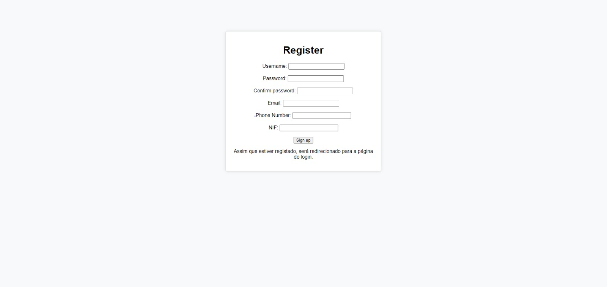

# Online Ticketing Platform

Development of an online ticketing platform using Python, Django and Postgres, for the Databases and Information Analysis class.

## Features
- Search events, venues and sessions. Filter results. Buy tickets. Login and registration. 
- Admin: edit login credentials; manage users; add and hide events/venues/sessions

## Examples

